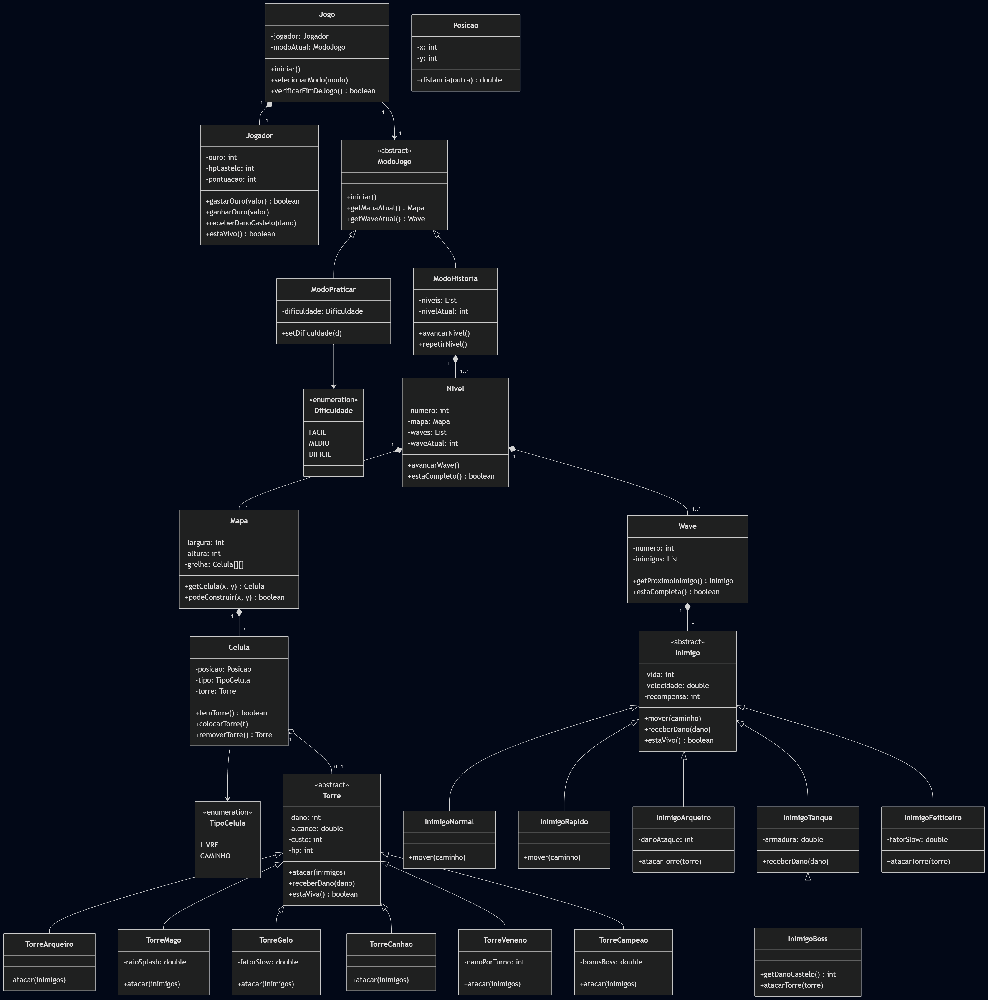
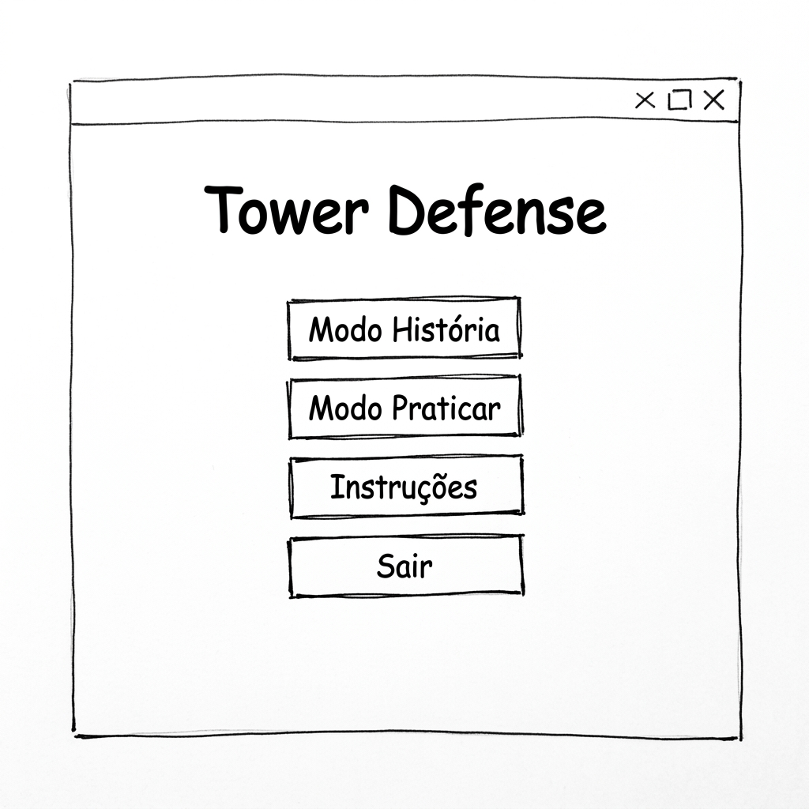
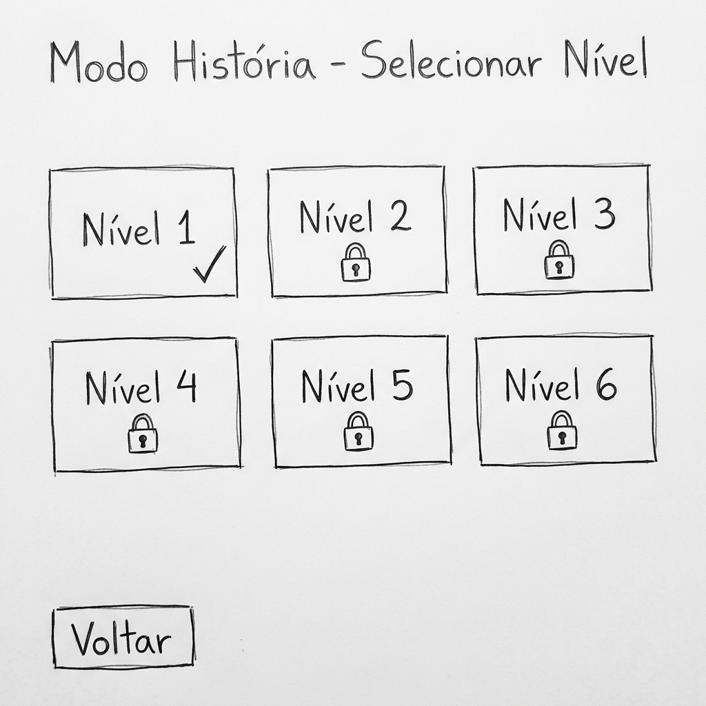
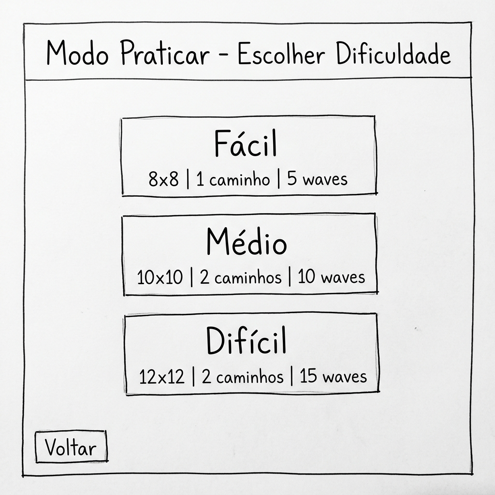
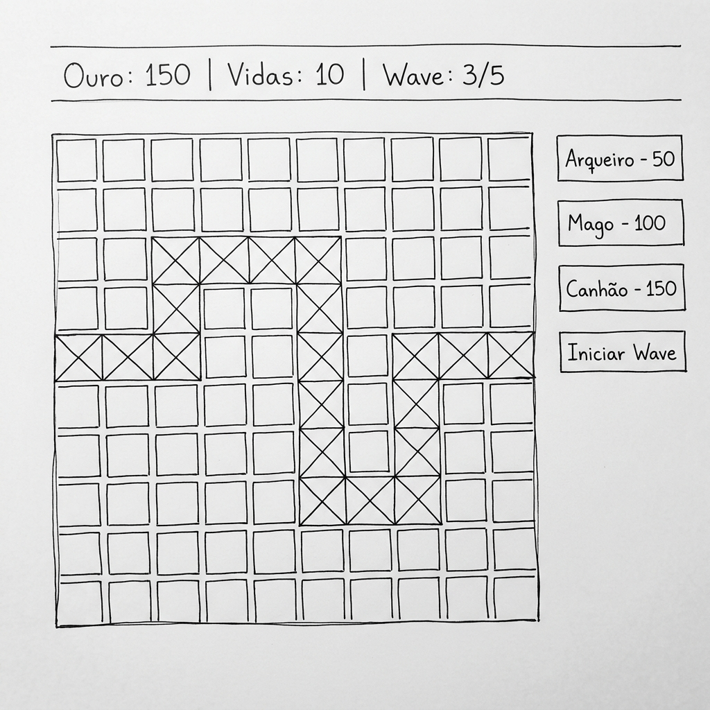
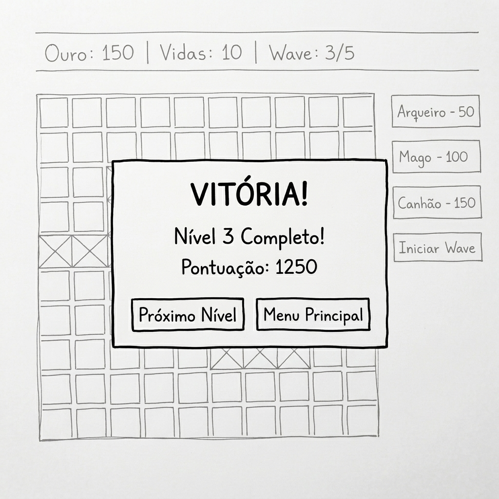
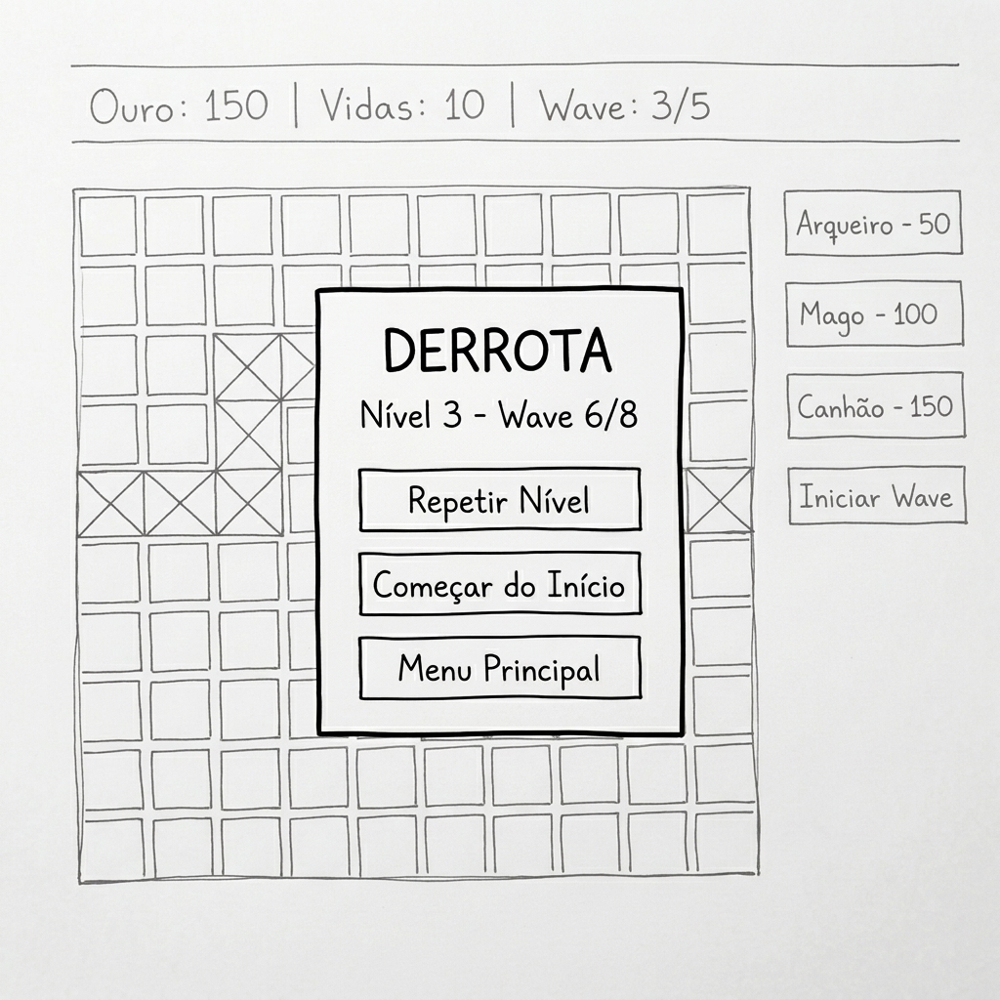
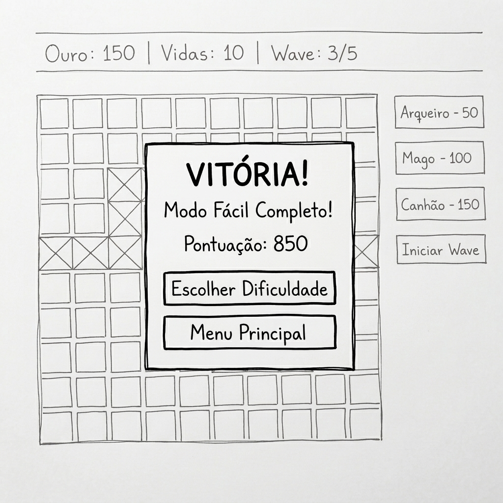
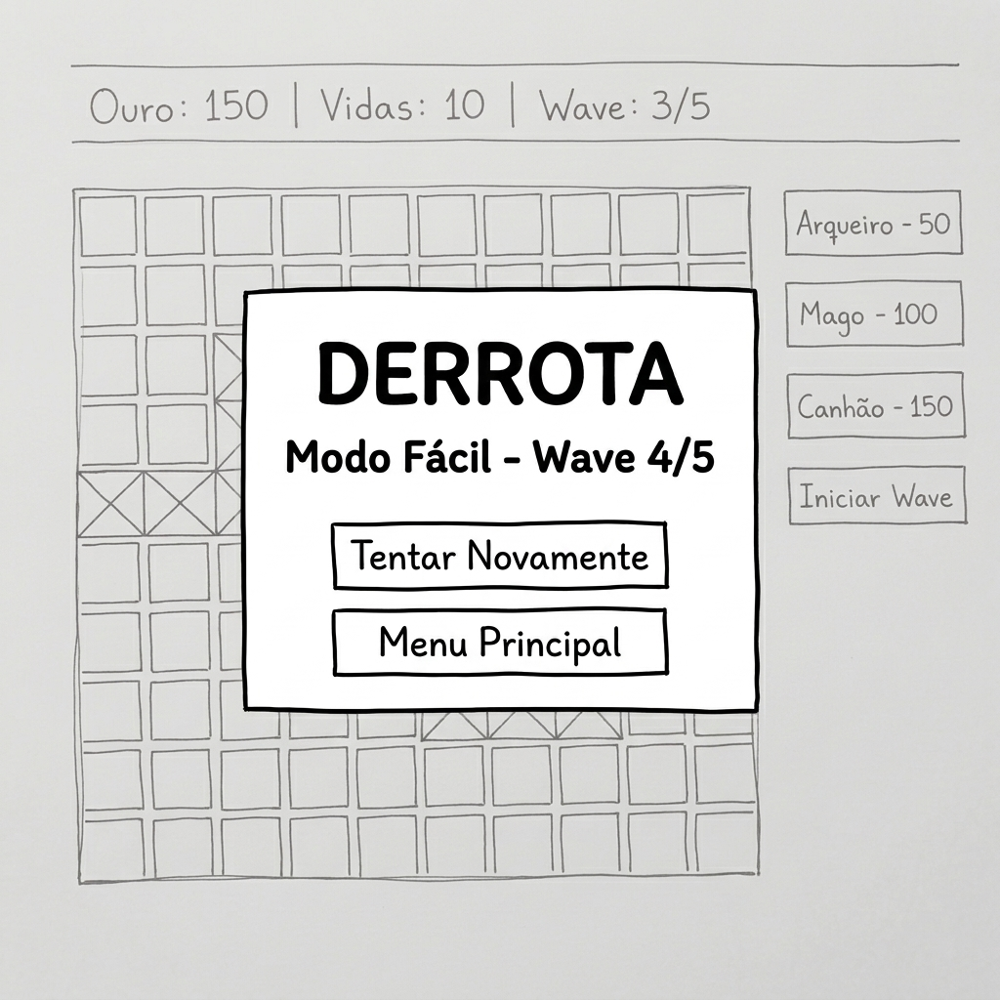

**Programação Orientada a Objetos** — 2025/2026  
**Professor:** Pedro Mesquita

| Aluno | Nº |
|-------|----|
| Hugo Barrelas | 2024144528 |
| Beatriz Vieira | 2024149895 |
| Elioenai Vitoreira | 2024146470 |

---

# Fase 1 , Especificação do Projeto

---

## 1. Descrição do Jogo

### 1.1 Conceito

Tower Defense é um jogo onde o jogador defende o seu castelo colocando heróis (torres) num mapa em grelha. Os inimigos percorrem um ou mais caminhos e o jogador tem de os eliminar antes que cheguem ao castelo. O jogo oferece dois modos: **Modo História** com progressão de níveis e desbloqueio de personagens, e **Modo Praticar** para treinar livremente.

### 1.2 Objetivo

Sobreviver a todas as waves de inimigos sem que o castelo seja destruído. O jogador compra e posiciona heróis estrategicamente no mapa que atacam automaticamente os inimigos à medida que estes avançam pelo caminho em direção ao castelo.

### 1.3 Regras Principais

- Heróis só podem ser colocados em células livres (fora do caminho dos inimigos).
- Cada herói tem um custo em ouro. O jogador ganha ouro ao derrotar inimigos.
- O jogador começa com um valor inicial de ouro (variável por dificuldade ou nível) e o castelo começa com um valor máximo de HP (pontos de vida).
- Os inimigos seguem caminhos predefinidos no mapa.
- Os heróis atacam automaticamente os inimigos dentro do seu alcance.
- Alguns inimigos atacam os heróis, podendo destruí-los. Quando um herói é destruído, o jogador recebe de volta 30% do custo.
- Os heróis têm pontos de vida (HP). Ao vender um herói voluntariamente, o jogador recebe 50% do custo de volta.
- As waves ficam progressivamente mais difíceis.
- Cada inimigo que chega ao castelo causa no mesmo. Inimigos normais tiram 1 HP e o Boss (inimigo mais forte) tira 3 HP.

### 1.4 Condições de Vitória e Derrota

- **Vitória:** Sobreviver a todas as waves do nível.
- **Derrota:** HP do castelo chega a 0.

### 1.5 Modos de Jogo

*Modo História*

No Modo História, o jogador progride por 6 níveis com dificuldade crescente. A cada nível, novos heróis e/ou inimigos são desbloqueados e os mapas tornam-se maiores e com mais caminhos. O jogador tem de completar um nível para desbloquear o seguinte. O progresso é mantido em memória durante a sessão e retoma ao início ao fechar o jogo.

**Nível 1** - Começa com o mais básico, ou seja, utiliza o mapa fácil (8×8) com 1 caminho e o jogador tem que sobreviver a 5 waves. O jogador começa com 3 heróis disponíveis (Arqueiro, Mago, Torre de Gelo) e 3 inimigos de diferentes tipos (Normal, Rápido, Arqueiro Inimigo). O ouro inicial é 300.

**Nível 2** - Continua a utilizar o mapa fácil (8×8) com 1 caminho e 5 waves, mas é desbloqueado um novo inimigo, o Tanque. Ficam 3 heróis e 4 inimigos. O ouro inicial é 275.

**Nível 3** - O mapa passa a médio (10×10) com 2 caminhos e 8 waves. É desbloqueado um novo herói, o Canhão. Ficam 4 heróis e 4 inimigos. O ouro inicial é 300.

**Nível 4** – O mapa, número de caminhos e de waves mantém-se, porém é desbloqueado um novo inimigo, o Feiticeiro, este ataca as torres e abranda a velocidade de ataque delas em 50% durante 3 segundos. Ficam 4 heróis e 5 inimigos. O ouro inicial é 275.

**Nível 5** - O mapa passa a difícil (12×12) com 2 caminhos e 10 waves. É desbloqueada a Torre de Veneno (herói que aplica dano contínuo). Aparece o Boss com 800 HP, que ataca os heróis, tem armadura de 30% e tira 3 HP ao castelo quando chega. Ficam 5 heróis e 6 inimigos. O ouro inicial é 300.

**Nível 6 (Final)** - Utiliza o mapa difícil (12×12) com 2 caminhos e 15 waves. É desbloqueado o Campeão (herói mais forte) com dano duplicado contra o Boss, que custa 300 de ouro e só pode ser comprado quando o Boss está a caminho do castelo ou já se encontra presente. Ficam 6 heróis e 6 inimigos. O Boss aparece várias vezes, chegando a 5 Boss na wave final. O ouro inicial é 350.

*Modo Praticar*

No Modo Praticar, o jogador escolhe a dificuldade e treina livremente. Todos os heróis e inimigos da dificuldade escolhida estão disponíveis desde o início.

**Fácil** - Mapa 8×8 com 1 caminho e 5 waves. 3 heróis (Arqueiro, Mago, Torre de Gelo) e 3 inimigos (Normal, Rápido, Arqueiro Inimigo). O ouro inicial é 300.

**Médio** - Mapa 10×10 com 2 caminhos e 10 waves. 4 heróis (Arqueiro, Mago, Torre de Gelo, Canhão) e 4 inimigos (Normal, Rápido, Arqueiro Inimigo, Tanque). O ouro inicial é 250.

**Difícil** - Mapa 12×12 com 2 caminhos e 15 waves. 5 heróis (Arqueiro, Mago, Torre de Gelo, Canhão, Torre Veneno) e tem o Campeão disponível nas waves 13-15 quando o Boss aparece. 6 inimigos (Normal, Rápido, Arqueiro Inimigo, Tanque, Feiticeiro, Boss). O ouro inicial é 200.

Quando existe 2 caminhos, os inimigos são divididos aproximadamente pela metade. Os caminhos podem cruzar-se sem que os inimigos se perturbem mutuamente.

### 1.6 Heróis (6 tipos)

**Arqueiro** , Dano: 25, ataque rápido, alcance 3, custo 50, HP 100. Ataque a alvo único.

**Mago** , Dano: 40, ataque lento, alcance 4, custo 100, HP 80. Dano em área (splash).

**Torre de Gelo** , Dano: 10, ataque médio, alcance 3, custo 120, HP 90. Abranda inimigos no alcance.

**Canhão** , Dano: 80, ataque muito lento, alcance 2, custo 150, HP 120. Dano muito alto a alvo único.

**Torre Veneno** , Dano: 15, ataque rápido, alcance 3, custo 130, HP 100. Aplica veneno (dano contínuo por turno).

**Campeão** , Dano: 100, ataque médio, alcance 3, custo 300, HP 200. Faz dano dobrado (2×) contra o Boss. Máximo 2 no mapa. Só pode ser comprado quando o Boss aparece.

### 1.7 Inimigos (6 tipos)

**Normal** , Vida: 100, velocidade: 1.0, recompensa: 10 ouro. Sem habilidade especial, apenas anda em direção ao castelo. Presente em todas as dificuldades.

**Rápido** , Vida: 60, velocidade: 2.0, recompensa: 15 ouro. Velocidade alta, difícil de acertar. Presente em todas as dificuldades.

**Arqueiro Inimigo** , Vida: 70, velocidade: 0.8, recompensa: 20 ouro. Ataca os heróis enquanto anda pelo caminho (dano direto). Presente em todas as dificuldades a partir da wave 2.

**Tanque** , Vida: 300, velocidade: 0.5, recompensa: 25 ouro. Muita vida com armadura que reduz o dano recebido em 20%. Presente a partir do modo médio / nível 2.

**Feiticeiro** , Vida: 60, velocidade: 0.7, recompensa: 30 ouro. Ataca os heróis e abranda a velocidade de ataque deles em 50% durante 3 segundos. Presente a partir do modo difícil / nível 4.

**Boss** , Vida: 800, velocidade: 0.3, recompensa: 100 ouro. O mais forte de todos: ataca os heróis, tem armadura de 30%, e tira 3 HP ao castelo quando chega. Aparece 1 por wave, apenas nas waves finais. Presente a partir do modo difícil / nível 5.

---

## 2. Modelação do Domínio

### 2.1 Entidades e Responsabilidades

**Jogo** , Controla o fluxo geral: gere os modos de jogo, a sessão atual, verifica condições de vitória/derrota.

**ModoJogo** *(abstrato)* , Define a interface comum dos modos de jogo.

**ModoHistoria** , Gere a progressão dos 6 níveis e o desbloqueio de personagens.

**ModoPraticar** , Gere a seleção de dificuldade e o jogo livre.

**Nivel** , Representa um nível do modo história com configuração de mapa, waves e personagens disponíveis.

**Jogador** , Guarda o estado do jogador: ouro, HP do castelo e pontuação.

**Mapa** , Contém a grelha de células e define os caminhos dos inimigos.

**Celula** , Posição individual na grelha. Pode ser livre (para colocar herói) ou caminho (por onde passam os inimigos).

**Posicao** , Coordenadas (x, y) no mapa.

**Torre** *(abstrata)* , Define atributos e comportamentos comuns a todos os heróis: dano, alcance, velocidade de ataque, custo e HP.

**TorreArqueiro, TorreMago, TorreGelo, TorreCanhao, TorreVeneno, TorreCampeao** , 6 subclasses de Torre, cada uma com a sua habilidade específica.

**Inimigo** *(abstrato)* , Define atributos e comportamentos comuns a todos os inimigos: vida, velocidade e recompensa.

**InimigoNormal, InimigoRapido, InimigoArqueiro, InimigoTanque, InimigoFeiticeiro, InimigoBoss** , 6 subclasses de Inimigo. O InimigoBoss herda do InimigoTanque (herança multi-nível).

**Wave** , Define uma onda de inimigos com tipo e quantidade.

**Dificuldade** *(enum)* , FACIL, MEDIO, DIFICIL.

**TipoCelula** *(enum)* , LIVRE, CAMINHO.

### 2.2 Relações entre Entidades

- O **Jogo** contém exatamente um **Jogador** (composição 1:1) e tem um **ModoJogo** ativo (associação).
- **ModoHistoria** e **ModoPraticar** herdam de **ModoJogo** (herança).
- **ModoPraticar** usa uma **Dificuldade** (associação).
- **ModoHistoria** contém 6 **Nivel** (composição 1:*).
- Cada **Nivel** contém um **Mapa** (composição 1:1) e múltiplas **Wave** (composição 1:*).
- O **Mapa** é composto por múltiplas **Celula** (composição 1:*).
- Cada **Celula** pode ter no máximo uma **Torre** (agregação 0..1) e tem um **TipoCelula**.
- Cada **Wave** gera múltiplos **Inimigo** (composição 1:*).
- **Torre** tem 6 subclasses (herança simples).
- **Inimigo** tem 5 subclasses diretas + **InimigoBoss** herda de **InimigoTanque** (herança multi-nível).

---

## 3. Modelo de Classes

### 3.1 Diagrama UML

### 3.2 Hierarquias de Herança

**Hierarquia 1 – Heróis (Torres):**

Torre (abstract) → TorreArqueiro, TorreMago, TorreGelo, TorreCanhão, TorreVeneno, TorreCampeão.

**Hierarquia 2 – Inimigos:**

Inimigo (abstract) → InimigoNormal, InimigoRápido, InimigoArqueiro, InimigoTanque, InimigoFeiticeiro. O InimigoTanque tem uma subclasse que é InimigoBoss (herança multi-nível, o Boss herda a armadura do Tanque).

**Hierarquia 3 – Modos de Jogo:**

ModoJogo (abstract) → ModoHistória, ModoPraticar.

### 3.3 Conceitos POO Demonstrados

**Abstração** , As classes abstratas Torre, Inimigo e ModoJogo definem contratos sem implementação concreta.

**Encapsulamento** , Todos os atributos são privados com acesso controlado via getters/setters. Por exemplo, a classe Jogador controla internamente o ouro e o HP do castelo.

**Herança** , 3 hierarquias: Torres (6 subclasses), Inimigos (6 subclasses com herança multi-nível) e ModoJogo (2 subclasses).

**Herança Multi-nível** , Inimigo → InimigoTanque → InimigoBoss. O Boss herda a armadura do Tanque e adiciona as suas próprias habilidades.

**Polimorfismo** , O método atacar() comporta-se de forma diferente em cada tipo de torre. O método mover() varia para cada inimigo. O método getDanoCastelo() retorna 3 para o Boss e 1 para os outros.

**Composição** , O Mapa é composto por Celulas. O Nivel contém Mapa e Waves. O ModoHistoria contém Niveis.

**Enumeração** , TipoCelula (LIVRE, CAMINHO) e Dificuldade (FACIL, MEDIO, DIFICIL).

---

## 4. Protótipo da Interface Gráfica

A interface é composta por 8 ecrãs organizados em dois fluxos, o Modo História e o Modo Praticar.

Todos estes protótipos foram criados no Nano Banana Pro, simulando esboços de interface feitos à mão. O objetivo é validar a estrutura inicial antes da implementação em JavaFX (Fase 2), etapa em que iremos adicionar o esquema de cores definitivo e todos os detalhes de acabamento.

### 4.1 Ecrã 1 , Menu Principal

O Menu principal contém 4 opções, sendo elas o "Modo História" que leva à seleção de nível, "Modo Praticar" que leva à seleção de dificuldade, "Instruções" mostra as regras e personagens do jogo e "Sair" que fecha a aplicação.

### 4.2 Ecrã 2 , Seleção de Nível (Modo História)

Existem 6 botões de nível em grelha. O Nível 1 está desbloqueado por defeito e os restantes têm cadeado até o jogador completar o nível anterior.

### 4.3 Ecrã 3 , Seleção de Dificuldade (Modo Praticar)

Encontram-se 3 botões com a informação de cada dificuldade, o tamanho do mapa, os caminhos e waves.

### 4.4 Ecrã 4 , Ecrã de Jogo

Na barra superior encontra-se o ouro, HP do castelo e wave atual. A Zona central apresenta a grelha do mapa (caminho marcado com X). O Painel lateral, por sua vez, tem os botões dos heróis com o seu custo e também o botão "Iniciar Wave". O jogador clica numa célula livre para colocar o herói selecionado.

### 4.5 Ecrã 5 , Vitória (Modo História)

Pop-up sobre o ecrã de jogo com a mensagem de vitória e pontuação.

### 4.6 Ecrã 6 , Derrota (Modo História)

Pop-up sobre o ecrã de jogo indicando onde o jogador perdeu.

### 4.7 Ecrã 7 , Vitória (Modo Praticar)

Pop-up sobre o ecrã de jogo com a mensagem de vitória e pontuação.

### 4.8 Ecrã 8 , Derrota (Modo Praticar)

Pop-up sobre o ecrã de jogo indicando onde o jogador perdeu.

### 4.9 Navegação entre Ecrãs

A partir do Menu Principal, o jogador pode ir para a Seleção de Nível (Modo História), Seleção de Dificuldade (Modo Praticar) ou Instruções. Ao escolher um nível ou dificuldade, entra no Ecrã de Jogo. No final de cada partida, aparece o pop-up correspondente com as opções de navegação.
